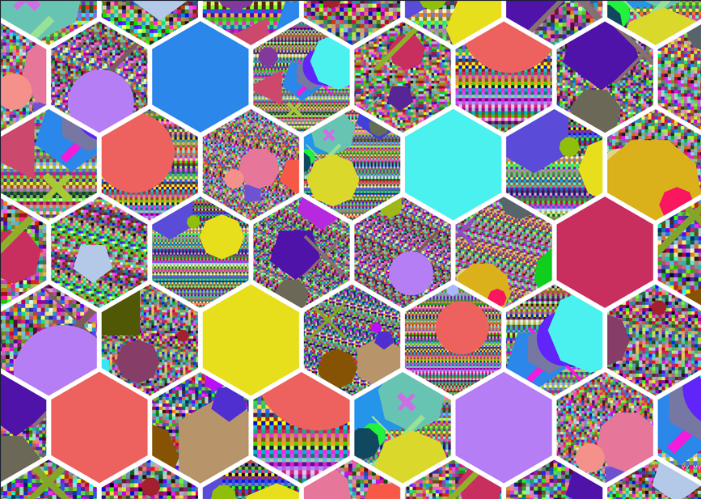

# Word-Based Image Generator

This Python script generates unique images based on input words or phrases. Each word is converted into a hash, which determines the colors and shapes used in the generated images. The script produces three variations for each word: original, capitalized, and uppercase.

## Features
- Generates abstract images from words or sentences.
- Uses SHA-256 hashing to create unique patterns.
- Draws various shapes (circles, lines, crosses, triangles, rectangles, and polygons) with randomized attributes.
- Saves generated images in a structured folder.

## Requirements
- Python 3.x
- Pillow (PIL)

You can install the required dependencies using:
```sh
pip install pillow
```

## Usage
Modify the `words` list in the script to include the words or phrases you want to generate images for:
```python
words = ["foo", "live laugh love", "girlfriend", "dog's name"]
```
Run the script:
```sh
python script.py
```
This will create a folder named `64x64` (or based on the image dimensions) and save the generated images inside it.

## Output
Each word will produce three images:
- `{timestamp}_{word}_small.png` (original casing)
- `{timestamp}_{Word}_cap.png` (capitalized)
- `{timestamp}_{WORD}_up.png` (uppercase)

## Creative Possibilities
If you're creative, you can stack or tile the generated images together in a larger composition, as shown in the example below:



## Example
If the input word is `hello`, the script will generate:
- `20250211_hello_small.png`
- `20250211_Hello_cap.png`
- `20250211_HELLO_up.png`

## License
This project is open-source under the MIT License. Feel free to modify and expand it!
